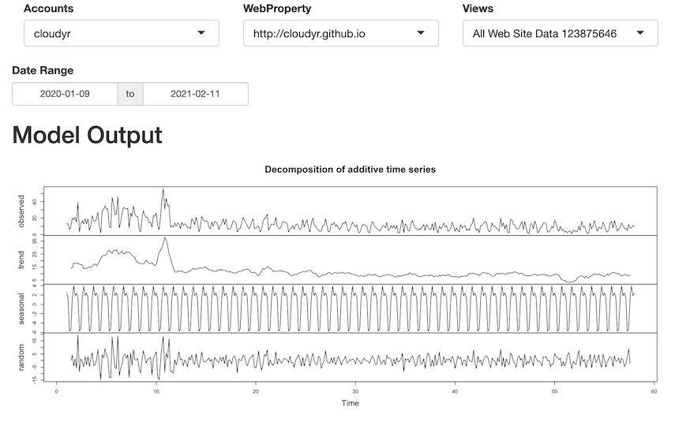
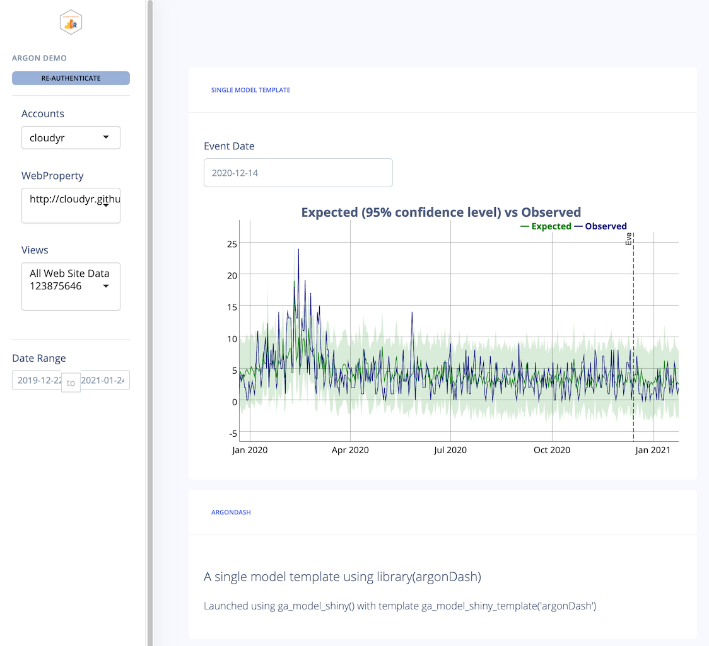
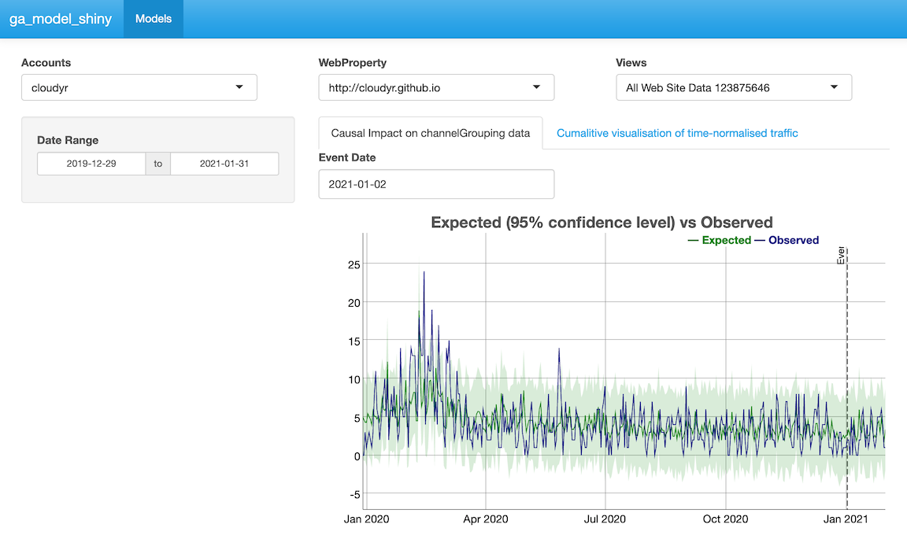
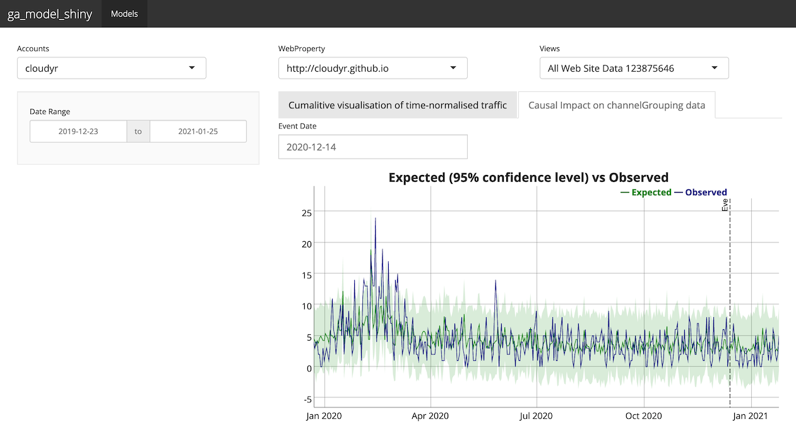
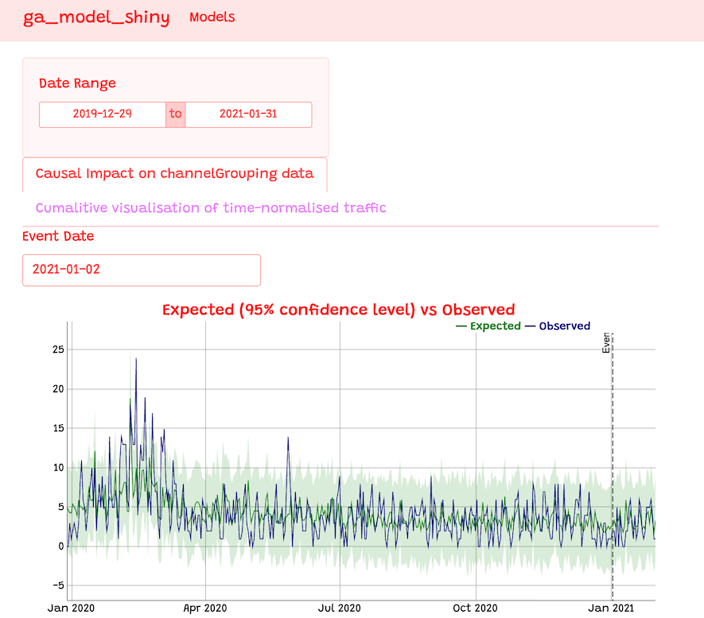
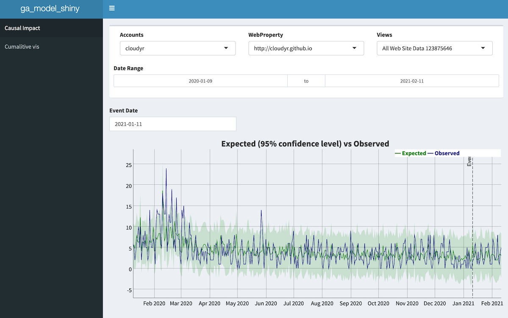

```{r setup, include=FALSE}
library(googleAnalyticsR)
```

Once you have a `ga_model()` object, they can be used to generate interactive Shiny apps via the `ga_model_shiny()` function.  This uses template Shiny application files and the know data, model and plotting functions within the `ga_model()` object to create Shiny apps.

Templates can be created that have many Shiny features pre-installed, and so can aid quicker startup and iteration of Shiny apps using Google Analytics data. Several example templates are included within the package.

Features include:

* Interactive OAuth2 authentication 
* Styling and swapping themes quickly
* Supports any type of Shiny template, including HTML
* Advanced Shiny features such as caching from Shiny 1.6
* Output Shiny code to file for deployment elsewhere
* Support for GA4 and Universal Analytics account pickers
* Multiple models can be viewed in one Shiny app

For authentication, you will need to create a Web based Client ID JSON file (as opposed to the Desktop app JSON file for local use) at `https://console.cloud.google.com/apis/credentials` and add an Authorised redirect URI - for local testing `http://localhost:1221` is helpful if you have set your Shiny apps to a static port via `options(shiny.port = 1221)`.  See the [`googleAuthR` website for details](https://code.markedmondson.me/googleAuthR/articles/google-authentication-types.html#shiny-authentication-examples).

## Example Template Outputs

These are just demos, and the main point is that the templates can be configured to be anyway you like.

### The Basic (default)

For quick iteration through models

```r
model <- ga_model_example("decomp_ga.gamr")
ga_model_shiny(model, auth_dropdown = "universal")
```



### Gentelella

Using a custom theme from https://github.com/MarkEdmondson1234/gentelellaShiny and a `ga_model()` using [CausalImpact](http://google.github.io/CausalImpact/CausalImpact.html) and [dygraphs](https://rstudio.github.io/dygraphs/)

```r
model <- ga_model_example("ga-effect.gamr")
ga_model_shiny(model, auth_dropdown = "universal",
               template = ga_model_shiny_template("gentelella"))
```


### argonDash

Mobile friendly Shiny themes from https://rinterface.github.io/argonDash/

```r
model <- ga_model_example("ga-effect.gamr")

ga_model_shiny(
  model,
  title = "Argon Demo",
  auth_dropdown = "universal",
  template = ga_model_shiny_template("argonDash"))
```



### Shinythemes

Using https://rstudio.github.io/shinythemes/

Themes can be configured to support multiple models

```r
m3 <- ga_model_example("time-normalised.gamr")
m4 <- ga_model_example("ga-effect.gamr")

ga_model_shiny(list(m4, m3), 
               auth_dropdown = "universal", 
               template = ga_model_shiny_template("shinythemes"), 
               theme = "cerulean")
```



```r
ga_model_shiny(list(m4, m3), 
               auth_dropdown = "universal", 
               template = ga_model_shiny_template("shinythemes"), 
               theme = "yeti")
```



### BS LIB

Custom bootstrap themes via https://rstudio.github.io/bslib/

```r
m3 <- ga_model_example("time-normalised.gamr")
m4 <- ga_model_example("ga-effect.gamr")

ga_model_shiny(list(m4, m3), auth_dropdown = "universal",
               template = ga_model_shiny_template("basic_bslib"), 
               bg = "white", fg = "red", primary = "grey")

```



### Shinydashboard

Using shinydashboard https://rstudio.github.io/shinydashboard/

```r
ga_model_shiny(list(m4, m3), auth_dropdown = "universal", 
               template = ga_model_shiny_template("shinydashboard"), 
               skin = "blue")
```




## The templates

A list of currently available template folders you can base your own upon is here:

```{r}
# current templates available in inst/models/shiny_templates
ga_model_shiny_template()
```

To use, supply a model and a template to the `ga_model_shiny()` function:

```r
# A Shiny app using "decomp_ga.gamr" model with the "shinythemes" template
ga_model_shiny(
  ga_model_example("decomp_ga.gamr"), 
  auth_dropdown = "universal",
  template = ga_model_shiny_template("shinythemes"))
```

If a `server.R` file is not supplied, then it will take the default `server.R` from `bootstrap` files.

## Creating templates

You can read existing template files using the `read_lines=TRUE` flag:

```{r}
ga_model_shiny_template("basic/ui.R", read_lines = TRUE)
```

You can also print out the entire app rather than launching it by supplying a folder to write out the Shiny code:

```r
ga_model_shiny(
    ga_model_example("decomp_ga.gamr"), 
    auth_dropdown = "universal", 
    local_folder = "my_app")
```

Use this to help craft your own templates.


### Template macro variables

Put these macros within the `ui.R` or `server.R` shiny files to import them when loading via `ga_model_shiny()`

* `{{{ model_libraries }}}` - Adds library() calls based on models$required_packages

* `{{{ web_json }}}` - Adds Google OAuth2 client for web applications

* `{{{ scopes }}}` - Adds Google OAuth2 scopes for the API calls

* `{{{ deployed_url }}}` - Adds option(googleAuthR.redirect) option for deployed Shiny apps

* `{{{ model_load }}}` - Adds ga_model_load calls loading all models in the list passed to this function's models argument. It creates R objects called 'model1', 'model2' etc. in the Shiny app code

* `{{{ model_list }}}` - Adds a list of the model objects after model_load. Useful for creating custom functions in themes that can loop over model objects

* `{{{ shiny_title }}}` - Adds the title to the Shiny app

* `{{{ auth_ui }}}` - Adds the correct dropdown Shiny module for picking a GA4 or Universal Analytics properties

* `{{{ date_range }}}` - Adds a shiny::dateInput() date selector with id "date_range" for use in model's data fetching functions

* `{{{ model_ui }}}` - Adds the models UI elements as configured in the ga_model object. It uses the object loaded above via the model_load macro. It looks like model1$ui('model1') in the code.

* `{{{ auth_server }}}` - Adds the authentication module's server side function

* `{{{ auth_accounts }}}` - Adds a call to ga_account_list for the appropriate GA account type (GA4 or Universal)

* `{{{ model_server }}}` - Adds the server side module for the models as configured in the ga_model configuration. It uses the object loaded above via the model_load macro. It looks like model1$server('model1') in the code.

* `{{{ model1 }}}` - Alternative to model_load, this will load the model file location instead, which you can pass to ga_model_load() in the template. model1 is the first model passed, model2 the second, etc.

* `{{{ your_argument }}}` - You can pass in your own custom variables to the template via the ... argument of this function if they are named the same as the template macro variable


### Boilerplate files

There are some common shared code that is available in the `boilerplate` files.

* header_boilerplate.R - for loading the models and libraries in a UI

```r
# ---start header_boilerplate.R
library(shiny)
library(googleAuthR)
library(googleAnalyticsR)
{{{ model_libraries }}}

gar_set_client(web_json = "{{ web_json }}",
               scopes = "{{ scopes }}")
options(googleAuthR.redirect = "{{ deployed_url }}")

# loads pre-existing models
{{{ model_load }}}
# ---end header_boilerplate.R

```

* server_app_boilerplate.R - for a single app.R using a server for OAuth2

```r
# ---start server_app_boilerplate.R
server <- function(input, output, session){
  
  token <- gar_shiny_auth(session)
  
  {{{ auth_accounts }}}
  
  # module for authentication
  view_id <- {{ auth_server }}
  
  # module to display model results
  {{{ model_server }}}
  
}

shinyApp(gar_shiny_ui(ui, login_ui = silent_auth), server)
# ---end server_app_boilerplate.R
```

* server_boilerplate.R - for a Shiny app using multiple files (ui.R, server.R, etc.)

```r
# ---start server_boilerplate.R
function(input, output, session){
  
  token <- gar_shiny_auth(session)
  
  {{{ auth_accounts }}}
  
  # module for authentication
  view_id <- {{ auth_server }}
  
  # module to display model results
  {{{ model_server }}}
  
}
# ---end server_boilerplate.R
```

## Deploying Shiny apps

By default the Shiny app will run locally but you can also deploy them to Shiny hosting services such as shinyapps.io or a Shiny Server running on Cloud Run.  [`googleCloudRunner`](https://code.markedmondson.me/googleCloudRunner/) includes functions for easier deployment of Shiny apps to Cloud Run.

For deployment, you will need:

1. Ensure you have your web_json clientId file available
2. Write the Shiny app to the local folder
3. Deploy the app to see the final URL - copy-paste the URL.
4. Re-created the Shiny app with `deployed_url` argument set to the URL from step 3
5. Update your ClientId's permitted redirect URL to the app URL from step 3
6. Re-deploy the app

### Deployment options

If deploying to shinyapps.io or a local RStudio Connect instance you can use the "Deploy" button within RStudio.

If deploying to another environment you may want a Dockerfile holding your Shiny app, which is added to the deployment folder. 

To deploy to Cloud Run using [`googleCloudRunner`](https://code.markedmondson.me/googleCloudRunner/) the below code is an example:

```r
library(googleAnalyticsR)

# create the Shiny app - first time without deployed_url, second time with
ga_model_shiny(
    ga_model_example("decomp_ga.gamr"), 
    auth_dropdown = "universal",
    template = ga_model_shiny_template("basic_app"),
    deployed_url="https://cloudrun-test-ewjogewawq-ew.a.run.app",
    local_folder = "cloudrun_test")
    
# deploy the cloudrun_test folder that contains a Dockerfile
library(googleCloudRunner)

# run two times, first to generate the URL, the second to deploy the final app
cr_deploy_run("cloudrun_test/",
              remote = "cloudrun_test",
              tag = c("latest","$BUILD_ID"),
              max_instances = 1, # required for shiny
              concurrency = 80, 
              launch_browser = FALSE)
              
```             


An example Dockerfile may look like this:

```
# from rocker/shiny with googleAnalyticsR installed & configued for Cloud Run
FROM gcr.io/gcer-public/googleanalyticsr-shiny-cloudrun

# add any dependencies for your app here
# RUN install2.r --error -r 'http://cran.rstudio.com' googleAnalyticsR
# RUN installGithub.r MarkEdmondson1234/googleAnalyticsR

COPY . /srv/shiny-server/
```

Modify the Dockerfile to include any dependencies you may need for your app (e.g. dygraphs if using a dygraph enabled model)

### Helper Docker file - googleanalytics-shiny-cloudrun

The `gcr.io/gcer-public/googleanalyticsr-shiny-cloudrun` image is one that installed `googleAnalyticsR` on top or `rocker/shiny` and configures Shiny for use within Cloud Run.  See the [Deploying Shiny to Cloud Run use case on the googleCloudRunner website](https://code.markedmondson.me/googleCloudRunner/articles/usecases.html#deploying-shiny-to-cloud-run-1) for details.

The Dockerfile for that image is below:

```
FROM rocker/shiny

# install googleanalyticsr
RUN install2.r --error \ 
    -r 'http://cran.rstudio.com' \
    googleAnalyticsR \
    ## install Github packages
    && installGithub.r MarkEdmondson1234/googleAnalyticsR \
    ## clean up
    && rm -rf /tmp/downloaded_packages/ /tmp/*.rds

COPY app.R /srv/shiny-server/app.R
COPY app/ /srv/shiny-server/app/
COPY shiny-customised.config /etc/shiny-server/shiny-server.conf

EXPOSE 8080

USER shiny

# avoid s6 initialization
# see https://github.com/rocker-org/shiny/issues/79
CMD ["/usr/bin/shiny-server"]
```


