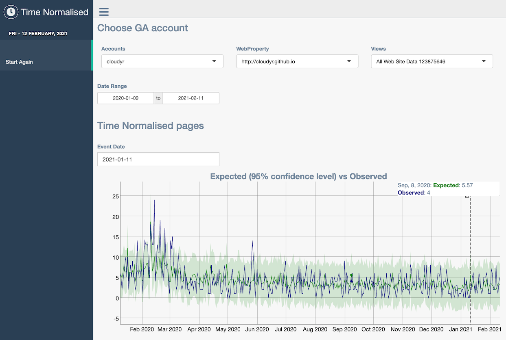

```{r setup, include=FALSE}
library(googleAnalyticsR)
```

Once you have a `ga_model()` object, they can be used to generate interactive Shiny apps via the `ga_model_shiny()` function.  This uses template Shiny application files and the know data, model and plotting functions within the `ga_model()` object to create Shiny apps.

Templates can be created that have many Shiny features pre-installed, and so can aid quicker startup and iteration of Shiny apps using Google Analytics data. Several example templates are included within the package.

Features include:

* Interactive OAuth2 authentication 
* Styling and swapping themes quickly
* Supports any type of Shiny template, including HTML
* Advanced Shiny features such as caching from Shiny 1.6
* Output Shiny code to file for deployment elsewhere
* Support for GA4 and Universal Analytics account pickers
* Multiple models can be viewed in one Shiny app

## Example Template Outputs

These are just demos, and the main point is that the templates can be configured to be anyway you like.

### The Basic (default)

For quick iteration through models

```r
model <- ga_model_example("decomp_ga.gamr")
ga_model_shiny(model, auth_dropdown = "universal")
```


### Gentelella

Using a custom theme from https://github.com/MarkEdmondson1234/gentelellaShiny and a `ga_model()` using [CausalImpact](http://google.github.io/CausalImpact/CausalImpact.html) and [dygraphs](https://rstudio.github.io/dygraphs/)

```r
model <- ga_model_example("ga-effect.gamr")
ga_model_shiny(model, auth_dropdown = "universal",
               template = ga_model_shiny_template("gentelella"))
```



### argonDash

Mobile friendly Shiny themes from https://rinterface.github.io/argonDash/

```r
model <- ga_model_example("ga-effect.gamr")

ga_model_shiny(
  model,
  title = "Argon Demo",
  auth_dropdown = "universal",
  template = ga_model_shiny_template("argonDash"))
```


### Shinythemes

Using https://rstudio.github.io/shinythemes/

Themes can be configured to support multiple models

```r
m3 <- ga_model_example("time-normalised.gamr")
m4 <- ga_model_example("ga-effect.gamr")

ga_model_shiny(list(m4, m3), 
               auth_dropdown = "universal", 
               template = ga_model_shiny_template("shinythemes"), 
               theme = "cerulean")
```


```r
ga_model_shiny(list(m4, m3), 
               auth_dropdown = "universal", 
               template = ga_model_shiny_template("shinythemes"), 
               theme = "yeti")
```


### BS LIB

Custom bootstrap themes via https://rstudio.github.io/bslib/

```r
m3 <- ga_model_example("time-normalised.gamr")
m4 <- ga_model_example("ga-effect.gamr")

ga_model_shiny(list(m4, m3), auth_dropdown = "universal",
               template = ga_model_shiny_template("basic_bslib"), 
               bg = "white", fg = "red", primary = "grey")

```


### Shinydashboard

Using shinydashboard https://rstudio.github.io/shinydashboard/

```r
ga_model_shiny(list(m4, m3), auth_dropdown = "universal", 
               template = ga_model_shiny_template("shinydashboard"), 
               skin = "blue")
```


## The templates

A list of currently available template folders you can base your own upon is here:

```{r}
# current templates available in inst/models/shiny_templates
ga_model_shiny_template()
```

To use, supply a model and a template to the `ga_model_shiny()` function:

```r
# A Shiny app using "decomp_ga.gamr" model with the "shinythemes" template
ga_model_shiny(
  ga_model_example("decomp_ga.gamr"), 
  auth_dropdown = "universal",
  template = ga_model_shiny_template("shinythemes"))
```

If a `server.R` file is not supplied, then it will take the default `server.R` from `bootstrap` files.

## Creating templates

You can read existing template files using the `read_lines=TRUE` flag:

```{r}
ga_model_shiny_template("basic/ui.R", read_lines = TRUE)
```

You can also print out the entire app rather than launching it by supplying a folder to write out the Shiny code:

```r
ga_model_shiny(
    ga_model_example("decomp_ga.gamr"), 
    auth_dropdown = "universal", 
    local_folder = "my_app")
```

Use this to help craft your own templates.


### Template macro variables

Put these macros within the `ui.R` or `server.R` shiny files to import them when loading via `ga_model_shiny()`

* `{{{ model_libraries }}}` - Adds library() calls based on models$required_packages

* `{{{ web_json }}}` - Adds Google OAuth2 client for web applications

* `{{{ scopes }}}` - Adds Google OAuth2 scopes for the API calls

* `{{{ deployed_url }}}` - Adds option(googleAuthR.redirect) option for deployed Shiny apps

* `{{{ model_load }}}` - Adds ga_model_load calls loading all models in the list passed to this function's models argument. It creates R objects called 'model1', 'model2' etc. in the Shiny app code

* `{{{ model_list }}}` - Adds a list of the model objects after model_load. Useful for creating custom functions in themes that can loop over model objects

* `{{{ shiny_title }}}` - Adds the title to the Shiny app

* `{{{ auth_ui }}}` - Adds the correct dropdown Shiny module for picking a GA4 or Universal Analytics properties

* `{{{ date_range }}}` - Adds a shiny::dateInput() date selector with id "date_range" for use in model's data fetching functions

* `{{{ model_ui }}}` - Adds the models UI elements as configured in the ga_model object. It uses the object loaded above via the model_load macro. It looks like model1$ui('model1') in the code.

* `{{{ auth_server }}}` - Adds the authentication module's server side function

* `{{{ auth_accounts }}}` - Adds a call to ga_account_list for the appropriate GA account type (GA4 or Universal)

* `{{{ model_server }}}` - Adds the server side module for the models as configured in the ga_model configuration. It uses the object loaded above via the model_load macro. It looks like model1$server('model1') in the code.

* `{{{ model1 }}}` - Alternative to model_load, this will load the model file location instead, which you can pass to ga_model_load() in the template. model1 is the first model passed, model2 the second, etc.

* `{{{ your_argument }}}` - You can pass in your own custom variables to the template via the ... argument of this function if they are named the same as the template macro variable


### Boilerplate files

There are some common shared code that is available in the `boilerplate` files.

* header_boilerplate.R - for loading the models and libraries in a UI

```r
# ---start header_boilerplate.R
library(shiny)
library(googleAuthR)
library(googleAnalyticsR)
{{{ model_libraries }}}

gar_set_client(web_json = "{{ web_json }}",
               scopes = "{{ scopes }}")
options(googleAuthR.redirect = "{{ deployed_url }}")

# loads pre-existing models
{{{ model_load }}}
# ---end header_boilerplate.R

```

* server_app_boilerplate.R - for a single app.R using a server for OAuth2

```r
# ---start server_app_boilerplate.R
server <- function(input, output, session){
  
  token <- gar_shiny_auth(session)
  
  {{{ auth_accounts }}}
  
  # module for authentication
  view_id <- {{ auth_server }}
  
  # module to display model results
  {{{ model_server }}}
  
}

shinyApp(gar_shiny_ui(ui, login_ui = silent_auth), server)
# ---end server_app_boilerplate.R
```

* server_boilerplate.R - for a Shiny app using multiple files (ui.R, server.R, etc.)

```r
# ---start server_boilerplate.R
function(input, output, session){
  
  token <- gar_shiny_auth(session)
  
  {{{ auth_accounts }}}
  
  # module for authentication
  view_id <- {{ auth_server }}
  
  # module to display model results
  {{{ model_server }}}
  
}
# ---end server_boilerplate.R
```