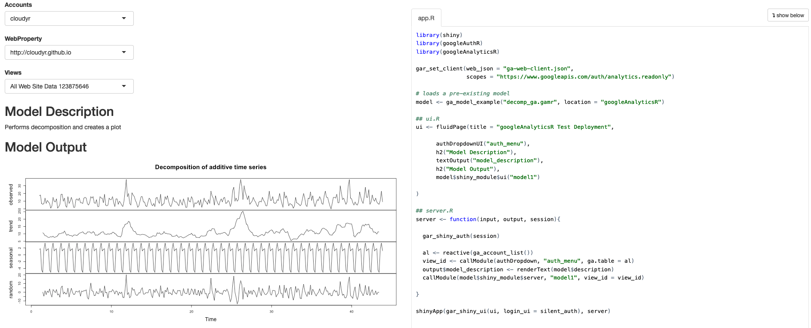
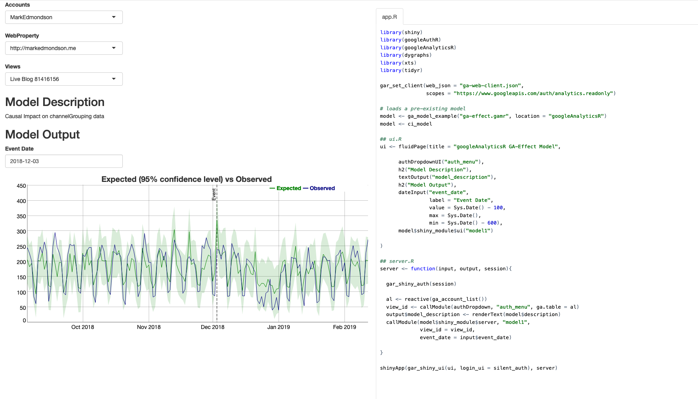

Downloading Google Analytics data is all well and good, but the reason most users want to use the API is to then operate and act upon that data.

There are several tutorials linked from the homepage that demonstrate various applications of using `googleAnalyticsR` to analyse data, but they can still be intimidating for new users of R.

To make it easier to distribute these analysis, `googleAnalyticsR` now includes the `ga_model_*` functions to help end users get to insights more quickly.

`ga_model` objects can be saved to the new `.gamr` format.  Loading these files using `ga_model()` and specifying your own Google Analytics viewId, all the data processing, modelling and visualisation steps can be encapsulated to give you the output.  

`.gamr` files also includes the ability to create Shiny modules which you can use to quickly create online Shiny dashboards displaying the model results, and which can switch to users own Google Analytics data using the multi-user login capabilities.

The `.gamr` file format can be shared with others online or within your organisation.  A new R package that includes some more advanced examples is available from [`IronistM/googleAnalyticsModelR/`](https://github.com/IronistM/googleAnalyticsModelR/)

## Pre-packaged examples

A ready-made model is available in the [`googleAnalyticsModelR` package](https://github.com/IronistM/googleAnalyticsModelR/).  This function loads the pre-made model object created by the `ga_model_*` functions in `googleAnalyticsR`.  

Some examples below (the graphs are interactive when looking on a webpage):

```{r message=FALSE, warning=FALSE}
library(prophet)
library(googleAnalyticsR)
library(googleAnalyticsModelR)

my_view_id <- 81416156

forecast_data <- ga_model_prophet(my_view_id, interactive_plot = TRUE)
forecast_data$plot
```

Time-normalised visits to your website:

```{r message=FALSE, warning=FALSE}
output <- ga_time_normalised(my_view_id, interactive_plot = TRUE)
output$plot
```

As we have a standardised model structure, it makes it easier to use the output in other functions.  For example, you can make a webpage suitable for embedding in Twitter tweets and upload via googleCloudStorageR using `ga_model_tweet()`:


```r
library(googleCloudStorageR)

ga_model_tweet(forecast_data, 
               "@HoloMarkeD", 
               title = "ga_model example - prophet forecasting",
               bucket = "mark-edmondson-public-read")

```

Which embeds in a tweet (you have to click the play icon to activate the visualisation):

<blockquote class="twitter-tweet"><p lang="en" dir="ltr">Still playing with embedding interactive plots in tweets. These are all made by one R function, googleAnalyticsR::ga_model_tweet : <a href="https://t.co/pos14U9x7j">https://t.co/pos14U9x7j</a> - this is the prophet forecasting example requested by <a href="https://twitter.com/VincentTerrasi?ref_src=twsrc%5Etfw">@VincentTerrasi</a></p>&mdash; Mark Edmondson (@HoloMarkeD) <a href="https://twitter.com/HoloMarkeD/status/1106948306515709954?ref_src=twsrc%5Etfw">March 16, 2019</a></blockquote> <script async src="https://platform.twitter.com/widgets.js" charset="utf-8"></script> 


## A simple example loading a model directly

The above loads models within a wrapper function, but you can also load model objects yourself via `ga_model_load()`. Included within the package are some simple models to demonstrate its use which use `ga_model_load()` to load from the package examples, via `ga_model_example()`

The example below performs decomposition on the sessions to your website.  Behind the scenes the model downloads your data with the right columns, applies the decomposition model then plots it, returning the data plotted for you to work with later:

```{r message=FALSE, warning=FALSE}
library(googleAnalyticsR)  # load library

# authenticate
ga_auth() 

# your own Google Analytics viewID
my_viewid <- 81416156

# load the model (equivalent to ga_model_load())
decomp_ga <- ga_model_example("decomp_ga.gamr")

# apply model to your data
d1 <- ga_model(my_viewid, model = decomp_ga)
```

This model allows you to alter the date range of the data fetched:

```{r message=FALSE, warning=FALSE}
# change default date range to 20 days ago to yesterday
d2 <- ga_model(my_viewid, model = decomp_ga, date_range = c("20daysAgo","yesterday"))
```

You can examine the properties of the model and the arguments it was sent via its print method:

```{r}
decomp_ga
```

You can also see an overview on how a particular call to a model was created by printing out the model's result directly to console:

```{r}
d2
```

And if you want to review the code of the model, use `ga_model_write()` to write the functions out to a file.

```r
ga_model_write(decomp_ga, "my_model.R")
```

## Shiny modules

The model can also be used to create a Shiny app, as it creates a [Shiny module](https://shiny.rstudio.com/articles/modules.html) of the model.  It is suggested this is the easiest route to turn your local GA analysis into Shiny apps. 

An example is shown below, which allows whoever logs in to apply the model to their own Google Analytics data.  You can run the app yourself via:

`shiny::runApp(system.file("shiny/hello-world-models", package="googleAnalyticsR"))`



The model code is encapsulated in the Shiny module so the actual Shiny app is relatively simple:

```r
library(shiny)
library(googleAuthR)
library(googleAnalyticsR) 

gar_set_client(web_json = "ga-web-client.json",
               scopes = "https://www.googleapis.com/auth/analytics.readonly")

# loads a pre-existing model
model <- ga_model_example("decomp_ga.gamr", location = "googleAnalyticsR")

## ui.R
ui <- fluidPage(title = "googleAnalyticsR Test Deployment",
                
                authDropdownUI("auth_menu"),
                h2("Model Description"),
                textOutput("model_description"),
                h2("Model Output"),
                model$shiny_module$ui("model1")
                
)

## server.R
server <- function(input, output, session){
  
  gar_shiny_auth(session)
  
  al <- reactive(ga_account_list())
  
  # module for authentication
  view_id <- callModule(authDropdown, "auth_menu", ga.table = al)
  output$model_description <- renderText(model$description)
  
  # module to display model results
  callModule(model$shiny_module$server, "model1", view_id = view_id)
  
}

shinyApp(gar_shiny_ui(ui, login_ui = silent_auth), server)

```

If you want to pass reactive input objects to your model's module, do so by wrapping them in `shiny::reactive()` e.g.

```r
  callModule(model$shiny_module$server,
             "model1",
             view_id = view_id,
             reactive_var = reactive(input$my_option))
```


## Creating model `.gamr` objects

To create your own models, you need to predefine all the functions to look after the fetching, modelling and viewing of the data.  You then pass those functions to the `ga_model_make()` function.

The functions need to follow these specifications:

* `data_f` - A function to collect the data you will need. The first argument should be the `view_id` which will be pass the viewId of Google Analytics property to fetch data from.
* `model_f` - A function to work with the data you have fetched. The first argument should be the data.frame that is produced by the data fetching function, `data_f()`.
* `output_f` - A function to plot the data. The first argument should be the data.frame that is produced by the model function, `model_f()`. 
* All functions you create must include `...` as an argument. 
* Take care if you use the same argument name that it is consistent with all functions as it will be passed to all of them.

If you want to also create the Shiny modules, then you also need to specify:

* `outputShiny` - the output function for the UI, such as `plotOutput`
* `renderShiny` - the render function for the server, such as `renderPlot`

You then supply supporting information to make sure the user can run the model:

* `required_columns` - Specification of which columns the data will fetch.  It will fail if they are not present.
* `required_packages` - The packages the end user needs to have installed to run your functions.
* `description` - A sentence on what the model is so they can be distinguished. 

To create the decomposition example model, this was applied as shown below:

```r
get_model_data <- function(viewId,
                           date_range = c(Sys.Date()- 300, Sys.Date()),
                           ...){
   google_analytics(viewId,
                    date_range = date_range,
                    metrics = "sessions",
                    dimensions = "date",
                    max = -1)
 }

decompose_sessions <- function(df, ...){
   decompose(ts(df$sessions, frequency = 7))
 }
 
decomp_ga <- ga_model_make(get_model_data,
                           required_columns = c("date", "sessions"),
                           model_f = decompose_sessions,
                           output_f = graphics::plot,
                           description = "Performs decomposition and creates a plot",
                           outputShiny = shiny::plotOutput,
                           renderShiny = shiny::renderPlot)
```

## Advanced use

The more arguments you provide to the model creation functions, the more complicated it is for the end user, but the more flexible the model.  It is suggested making several narrow usage models is better than one complicated one.

For instance, you could modify the above model to allow the end user to specify the metric, timespan and seasonality of the decomposition:

```{r}
get_model_data <- function(viewId,
                           date_range = c(Sys.Date()- 300, Sys.Date()),
                           metric,
                           ...){
   o <- google_analytics(viewId,
                    date_range = date_range,
                    metrics = metric,
                    dimensions = "date",
                    max = -1)
    # rename the metric column so its found for modelling
    o$the_metric <- o[, metric]
    
    o
    
 }

decompose_sessions <- function(df, frequency, ...){
   decompose(ts(df$the_metric, frequency = frequency))
 }
 
decomp_ga_advanced <- ga_model_make(get_model_data,
                           required_columns = c("date"), # less restriction on column
                           model_f = decompose_sessions,
                           output_f = graphics::plot,
                           description = "Performs decomposition and creates a plot",
                           outputShiny = shiny::plotOutput,
                           renderShiny = shiny::renderPlot)
                           
```

It would then be used via:

```{r message=FALSE, warning=FALSE}
result <- ga_model(81416156, decomp_ga_advanced, metric="users", frequency = 30)
```

### Working with the model object

The model objects prints to console in a friendly manner:

```{r}
decomp_ga_advanced
```
You can save and load model objects from a file.  It is suggested to save them with the `.gamr` suffix.

```r
# save model to a file
ga_model_save(decomp_ga_advanced, filename = "my_model.gamr")

# load model again
ga_model_load("my_model.gamr")
```

You can use models directly from the file:

```r
ga_model(81416156, "my_model.gamr")
```

If you need to change parts of a model, `ga_model_edit()` lets you change individual aspects:

```{r message=FALSE, warning=FALSE}
ga_model_edit(decomp_ga_advanced, description = "New description")
```

You can also pass it the filename, which will load, make the edit, then save the model to disk again:

```r
ga_model_edit("my_model.gamr", description = "New description")
```

If you want to examine or change the functions in a model, you can use `ga_model_write()` to write them to a file, or examine them directly from the model object.  The structure of the model object can be examined using `str()`:

```{r}
str(decomp_ga_advanced, give.attr = FALSE)
```

And you can access various elements by the usual list methods:
 
```{r}
decomp_ga_advanced$data_f


decomp_ga_advanced$description
```


## GA Effect with ga_models

To make your own portable [GA Effect](https://gallery.shinyapps.io/ga-effect/), this model uses the CausalImpact and dygraphs libraries to make a plot of your GA data.

This example model is available via `ga_model_example("ga-effect.gamr")`

### Get data

The data will focus on sessions per channel grouping.  For this example the end user can select the date range, but we set a default of the last 600 days.

```{r}
get_ci_data <- function(viewId, 
                        date_range = c(Sys.Date()-600, Sys.Date()),
                        ...){
  
  google_analytics(viewId, 
                   date_range = date_range,
                   metrics = "sessions",
                   dimensions = c("date", "channelGrouping"), 
                   max = -1)
}
```

The modelling step is copied over from the [dartistics.com time-services example](http://www.dartistics.com/timeseries.html).

The function transforms the data into the right shape, and performs the CausalImpact model.  The user can select the event date to examine, the channel to test (response) and possible predictors to help the model.

```{r}
# response_dim is the channel to predict.
# predictors help with forecast
do_ci <- function(df, 
                  event_date,
                  response = "Organic Search",
                  predictors = c("Video","Social","Direct"),
                  ...){
  
  message("CausalImpact input data columns: ", paste(names(df), collapse = " "))
  # restrict to one response 
  stopifnot(is.character(response), 
            length(response) == 1,
            assertthat::is.date(event_date),
            is.character(predictors))
  
  pivoted <- df %>% 
    tidyr::spread(channelGrouping, sessions)
  
  stopifnot(response %in% names(pivoted))
  
  ## create a time-series zoo object
  web_data_xts <- xts::xts(pivoted[-1], order.by = as.Date(pivoted$date), frequency = 7)
  
  pre.period <- as.Date(c(min(df$date), event_date))
  post.period <- as.Date(c(event_date + 1, max(df$date)))
  
  predictors <- intersect(predictors, names(web_data_xts))

  ## data in order of response, predictor1, predictor2, etc.
  model_data <- web_data_xts[,c(response,predictors)]
  
  # deal with names
  names(model_data) <- make.names(names(model_data))
  # remove any NAs
  model_data[is.na(model_data)] <- 0

  CausalImpact::CausalImpact(model_data,  pre.period, post.period)

}
```

Finally the CausalImpact model is sent into Dygraphs for interactive visualisation.  The event date is the same as the one sent to the modelling step, and used to indicate it on the plot:

```{r}
dygraph_plot <- function(impact, event_date, ...){

  ## the data for the plot is in here
  ci <- impact$series
  
  ci <- xts::xts(ci)

  ## the dygraph output
  dygraph(data=ci[,c('response', 
                     'point.pred', 'point.pred.lower', 'point.pred.upper')], 
          main="Expected (95% confidence level) vs Observed", group="ci") %>%
    dyEvent(x = event_date, "Event") %>%
    dySeries(c('point.pred.lower', 'point.pred','point.pred.upper'), 
             label='Expected') %>%
    dySeries('response', label="Observed")
}
```

The main functions done, we now specify which R packages the model needs the user to load.  

```{r}
req_packs <- c("CausalImpact", "xts", "tidyr", "googleAnalyticsR", "assertthat", "dygraphs")
```

Finally we make the model, specifying which columns we expect the data to fetch, a description and specifying which Shiny functions are needed to show the dygraph if the model is used in a Shiny app.

```{r}
library(googleAnalyticsR)
ci_model <- ga_model_make(get_ci_data,
                          required_columns = c("date","channelGrouping","sessions"),
                          model_f = do_ci,
                          output_f = dygraph_plot,
                          required_packages = req_packs,
                          description = "Causal Impact on channelGrouping data",
                          outputShiny = dygraphs::dygraphOutput,
                          renderShiny = dygraphs::renderDygraph)
# print out model details
ci_model
```


```r
# save it to a file for use later
ga_model_save(ci_model, "causalImpact_model.gamr")
```

To use and make an interactive plot:

```{r message=FALSE, warning=FALSE}
library(googleAnalyticsR)
library(CausalImpact)
library(xts)
library(tidyr)
library(dygraphs)

ci <- ga_model(81416156, ci_model, event_date = as.Date("2019-01-01"))

# print to show the plot object
ci$plot
```

That can display interactively in a tweet:

<blockquote class="twitter-tweet"><p lang="en" dir="ltr">An example for the documentation - CausalImpact/Dygraphs with ga_models <a href="https://t.co/9qfvi3uvLc">https://t.co/9qfvi3uvLc</a></p>&mdash; Mark Edmondson (@HoloMarkeD) <a href="https://twitter.com/HoloMarkeD/status/1106958249130119169?ref_src=twsrc%5Etfw">March 16, 2019</a></blockquote> <script async src="https://platform.twitter.com/widgets.js" charset="utf-8"></script> 

Similarly, you can launch this in a Shiny app by slightly modifying the Shiny example used previously.  

This is available within the package via `shiny::runApp(system.file("shiny/models-ga-effect", package="googleAnalyticsR"))`



Dress it up in a nice theme and add some more inputs and outputs and you are close to the finished result.

