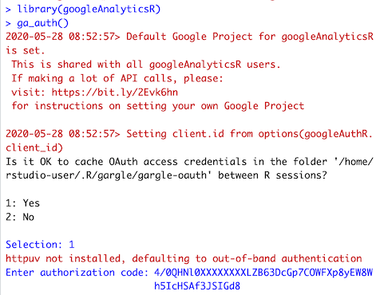
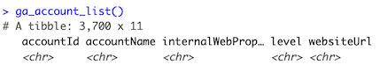

This guide will walk you through the steps required to properly set up googleAnalyticsR in terms of installation and authentication.

It assumes you have R installed on your machine and access rights to one or more Google Analytics accounts. In this case it will only take a few lines of R code to make a first test call to the GA API following the examples below. 

The rest of this guide will give you an overview of the available set up options and cover some good practices to follow under different scenarios of use.  

## 0. Quickstart RStudio Cloud Project

If you wish to try out the library before installation, an RStudio Cloud project is available that has the library pre-installed.

[Click this link and log in to RStudio Cloud to try it out](https://rstudio.cloud/project/1125233).

Once you are logged in, issue the following two R commands in the R console bottom-left:

```r
library(googleAnalyticsR)
ga_auth()
```

Select `1: Yes` to say you wish to keep your OAuth access credentials.

The library should then launch a browser window and ask you to login to Google - log in with an email that has access to your Google Analytics - it will take you to a screen with an OOB token.  Copy-paste that token back into RStudio:



(The OOB token is only needed on RStudio Cloud - if you have googleAnalyticsR installed locally on your desktop it will authenticate automatically via `httpuv`)

You should then be authenticated and ready to use the functions in the package.  Try `ga_account_list()` as a way to check you are authenticated correctly:



## 1. Install 

The latest stable version of `googleAnalyticsR` is available on CRAN.


```r
install.packages("googleAnalyticsR", dependencies = TRUE)
```

### Development version off GitHub

You may prefer to use the latest development version on GitHub which you can install via the below.

Github check status: [](https://travis-ci.org/MarkEdmondson1234/googleAnalyticsR)

```r
remotes::install_github("MarkEdmondson1234/googleAnalyticsR")
```

Check out the [NEWS](https://github.com/MarkEdmondson1234/googleAnalyticsR/blob/master/NEWS.md) to see whats currently available in each version.

### Docker image

If you know docker, then a public image is available at `gcr.io/gcer-public/googleanalyticsr`

* `gcr.io/gcer-public/googleanalyticsr:master` is the latest GitHub version
* `gcr.io/gcer-public/googleanalyticsr:CRAN` will be the last CRAN version

### Dependencies

`googleAnalyticsR` requires the packages described in the [`Imports` field of the `DESCRIPTION` file](https://github.com/MarkEdmondson1234/googleAnalyticsR/blob/master/DESCRIPTION) to be installed first, which it will do via `install.packages("googleAnalyticsR", dependencies = TRUE)`

The depedencies are roughly split into the following roles:

* `googleAuthR`, `gargle` are used for authentication with Google APIs
* `jsonlite`, `httr` work with API responses
* Tidyverse packages such as `dplyr` and `purrr` are used to make outputs easy to use (clean data.frames rather than nested lists)

Note that on linux systems, due to its reliance on [`httr`]( https://CRAN.R-project.org/package=httr ) and in turn [`curl`]( https://CRAN.R-project.org/package=curl), it may require installation of these dependencies via `apt-get` or similar: `libssl-dev` and `libcurl4-openssl-dev`.

If you install `httpuv` then the authentication flows will occur behind the scenes - this is normally installed by default but if you do not include it you will need to use the more manual OOB method to generate authentication tokens. 


## 2. Make your first API call 

Once you have installed the package you can make a first call to the GA API to test the connection.

```r
## setup
library(googleAnalyticsR)

## This should send you to your browser to authenticate your email. 
# Authenticate with an email that has access to the 
# Google Analytics View you want to use.
ga_auth()

## get your accounts
account_list <- ga_account_list()

## account_list will have a column called "viewId"
account_list$viewId

## View account_list and pick the viewId you want to extract data from. 
ga_id <- 123456

## simple query to test connection, get 10 rows
google_analytics(ga_id,
                 date_range = c("2017-01-01", "2017-03-01"),
                 metrics = "sessions",
                 dimensions = "date",
                 max = 10)

```

You can find more code examples to query the API in  [v4 API](http://code.markedmondson.me/googleAnalyticsR/articles/v4.html) and [v3 API](http://code.markedmondson.me/googleAnalyticsR/articles/v3.html) sections of the site. 

## 3.  Choose authentication method

### TL;DR

Use `ga_auth_setup()` to configure your own GCP project and set up auto-authentication options.

Recommended long term defaults are:

1. Create your own GCP project, download the client JSON and save to a global location, which you point to via a environment argument `GAR_CLIENT_JSON` in an `.Renviron` file e.g. `GAR_CLIENT_JSON=~/dev/auth/client.json`
2. Authenticate with `ga_auth(email="your@email.com")` to create an authentication token cache, and repeat the `ga_auth(email="your@email.com")` call to default to that email in future API calls
3. Set an environment argument `GARGLE_EMAIL` in the same `.Renviron` file to your email to auto-authenticate on package load e.g. `GARGLE_EMAIL=your@email.com`

### Details

To access the GA API authentication is required.  

The example in the previous section used the simplest among the three available ways to authenticate to the API. If you are planning to make systematic use of the API however, it's worth to know all the available options in order to choose the most suitable.

Note that no matter which method you use, the authentication is actually done via the [`googleAuthR`](http://code.markedmondson.me/googleAuthR/articles/google-authentication-types.html) package. In its documentation pages you can read more about advanced use cases. 

To authenticate you need a client project (that authentication is performed through) and the user email to authenticate with (that gives access to that user's Google Analytics accounts)

### Email authentication

As of version `googleAnalyticsR>=0.6.0.9000` authentication is done via the [`gargle` package]( https://CRAN.R-project.org/package=gargle).  This creates a global cache that is accessed via the email you authenticate with.  

If you use `ga_auth()` the first time then it will ask you to create email credentials.  You can then authenticate in the browser via your email.  The next time you wish to authenticate, `ga_auth()` will give you an option to use those credentials again:

```r
library(googleAnalyticsR)
ga_auth()
#>The googleAnalyticsR package is requesting access to your Google account. 
#> Select a pre-authorised account or enter '0' to obtain a new token. Press  #>Esc/Ctrl + C to abort.

#> 1: mark@work.com
#> 2: home@home.com
```

If you want to skip the menu, supply the email you wish to authenticate with:

```r
library(googleAnalyticsR)
ga_auth(email = "mark@work.com)
```

To auto-authenticate on package load, add an environment argument `GARGLE_EMAIL` via an `.Renviron` file or otherwise. 

e.g. in `.Renviron` 

`GARGLE_EMAIL=your@email.com`

### 'Try-it-out' mode: The default googleAnalyticsR project

The fast authentication way of the previous section worked via the default Google Cloud Project for googleAnalyticsR which is shared with all googleAnalyticsR users. Even though it is a shared project other package users are not able to see and access your GA data. 

However since Google has changed verification processes, the consent screen for the default googleAnalyticsR library may warn of 'danger', which you will need to trust and accept if you want to continue using the default project.  It is preferred to use your own and get your own verificataion process.

You can not use the default project for scheduled scripts on servers - only interactivly. The default library is only intended for users to get to know the library looking for data as quickly as possible. 

With the amount of API calls possible with this library via batching and walking, its more likely the default shared Google API project will hit the 50,000 calls per day quota.

However, using the default project means you will not need to go through the process outlined below to create your own Google Cloud Platform credentials and you can directly authenticate using the `ga_auth()` function and your browser as soon as the library is downloaded.

### ga_auth_setup()

A new setup function is available in versions >0.7.2 - use this to launch a wizard that will help you walk through some of the more advanced authentication setups detailed below.  You will need to create your own Google Cloud Project and download a client Id file to get started.

```r
library(googleAnalyticsR)
ga_auth_setup()
#ℹ ==Welcome to googleAnalyticsR v0.7.1.9000 setup==
#This wizard will scan your system for setup options and help you with any that are missing. 
#Hit 0 or ESC to cancel. 
#
#1: Setup your own client ID and secret
#2: Setup auto-authentication (OAuth2 email)
#3: Create and download JSON service account key
#4: Setup auto-authentication (JSON service account key)
#5: Add a service account email or another email to your GA account
```

### 'Professional' mode: Your own Google Project

To mitigate all the above, use your own Google Developer Console client ID, so it is not shared across all users of this library.

The easiest way to set this up is to create your own Google Cloud Platform project and then in R use the `ga_auth_setup()` function and select option 1.

#### SEtting up clientId manually

The setup function foes through the steps below.

1. Download your Google Cloud Project client JSON and place it in a location pointed to via the `GAR_CLIENT_JSON` environment argument.  

This file is found in the Google Cloud Platform under `APIs & Services > Credentials > Create credentials >  OAuth client ID > Other`.  For Shiny authentication, choose `Web application` instead of `Other`.

In the below examples the client ID file is downloaded to `~/dev/auth/gcp_client.json`

2. Set an environment argument to point at the location of the client ID:

```
# In your .Renviron
GAR_CLIENT_JSON=~/dev/auth/gcp_client.json
```

You can also set your clientID before the library is available via [`googleAuthR::gar_set_client()`](https://code.markedmondson.me/googleAuthR/reference/gar_set_client.html)

3. Once you have set the credentials for your project set these options before any call to `ga_auth()` or other data fetching calls.

If set via environment argument, restart R and then load the library:

```r
#Setting client.id from gar_auth_configure(path = json)
library(googleAnalyticsR)
ga_auth()
```

If setting in the script via [`googleAuthR::gar_set_client()`](https://code.markedmondson.me/googleAuthR/reference/gar_set_client.html) then it wil look like this:

```r
googleAuthR::gar_set_client("~/dev/auth/gcp_client.json")
library(googleAnalyticsR)
ga_auth()
```

The oldest method (deprecated) -
[Donal Phipps](http://donalphipps.co.uk/) has very kindly created a screencast on how to set this up that you can find embedded below and via [this link](https://www.youtube.com/watch?v=4B88dRbwNfc).

<iframe width="560" height="315" src="http://www.youtube.com/embed/4B88dRbwNfc?rel=0" frameborder="0" allowfullscreen></iframe>

```r
options(googleAuthR.client_id = "uxxxxxxx2fd4kesu6.apps.googleusercontent.com")
options(googleAuthR.client_secret = "3JhLa_GxxxxxCQYLe31c64")
options(googleAuthR.scopes.selected = "https://www.googleapis.com/auth/analytics")
```

### clientId examples

In the next example, the scopes are also set so a user can authenticate with [`searchConsoleR`](http://code.markedmondson.me/searchConsoleR/) at the same time, which is possible as they both use [`googleAuthR`](http://code.markedmondson.me/googleAuthR/) as a backend.

```r
googleAuthR::gar_set_client("~/dev/auth/gcp_client.json"
            scopes = c("https://www.googleapis.com/auth/analytics",
                       "https://www.googleapis.com/auth/webmasters"))
```

If you want to use with Shiny, then you need to download web based JSON client secrets.  In that case, you then set the webapp clientId/secrets (which could be the same GCP project as the "Other" credentials.)

```r
googleAuthR::gar_set_client(web_json = "~/dev/auth/gcp_web_client.json"
            scopes = c("https://www.googleapis.com/auth/analytics",
                       "https://www.googleapis.com/auth/webmasters"))
```


> Note:
> With either the default or your own GCP projects using the `ga_auth()` function, you can specify the email you will use by passing that to the `ga_auth()` function e.g. `ga_auth(email="my@email.com)`. This will skip the interactive menu choice for authentication.
> This can be useful when authenticating within an Rmarkdown document in which case it is recommended to specify your email  (an Rmarkdown document can change the working directory during knitting). 


### 'Server' mode: Google Cloud service account

You can alternatively authenticate by downloading a JSON file attached to a Google Cloud service account.  More details on how to do that are on the [`googleAuthR` website](http://code.markedmondson.me/googleAuthR/articles/google-authentication-types.html#authentication-with-a-json-file-via-service-accounts).  

A service authentication file then needs to be created that has edit access to the GA account.  It is recommended to make a dedicated service account if you don't need it for anything else. 

The easiest way is to use `ga_auth_setup()` and select option 3

#### Manual setup

If you want to set it up yourself, the setup wizard goes through these steps:

1. Create your own Google Cloud Project or use an existing one.
2. Set your own client.id/secret via `googleAuthR::gar_set_client()`
3. Service accounts for your project can be created at this link: `https://console.cloud.google.com/iam-admin/serviceaccounts/create`
4. The service account does not need any GCP account permissions (we do that in next step when we add to GA)
5. After you can see your service account in the list, create a JSON key for that service account and download it somewhere safe
6. Copy the service email e.g. `ga-access@your-project.iam.gserviceaccount.com`
7. Login to Google Analytics and add the email to your account at the level of permissions you want.  If you want to upload data or update filters etc. then it needs at least edit permissions, if it just needs to read data then Viewer access is fine. 
8. Make sure the GCP project the service key is for has both the Analytics API and the Analytics Reporting API access enabled.  You can reach this via the Google API & Services dashboard URL: `https://console.developers.google.com/apis/dashboard`

You should now be able to use the JSON auth file to authenticate with Google Analytics API via:

```r
library(googleAnalyticsR)
ga_auth(json_file = "your_auth_file.json")

# test authentication
al <- ga_account_list()
```

Note: A service account is a special type of account that belongs to an application rather than an individual user. If you should use this option, chances are you are already familiar with how they work. If however you wish to find out more about when and how to use service accounts, follow the link to the Google Cloud documentation page on [Understanding Service Accounts](https://cloud.google.com/iam/docs/understanding-service-accounts) 

## 4 (optional): Review useful auth options 


This section covers some other aspects of authentication under various scenarios of use. This information is useful especially if you work systematically with Google Analytics and possibly other Google products too. 

### Auto-authentication

To save authenticating and setting your GCP client each R session, you can specify the files/email in an `.Renviron` file that will be looked for each time you load `library(googleAnalyticsR)`

* `GAR_CLIENT_JSON` takes care of the GCP project client.id to authenticate under
* `GARGLE_EMAIL` lets you specify an email address that has already authenticated to skip the interactive menu. Make sure you authenticate with the right scopes and GCP project first in an interactive session.
* `GA_AUTH_FILE` is an optional argument if you have a service JSON key

You can set environment arguments via `Sys.setenv()` or using an `.Renviron` file saved in your home directory, but the recommended way is to use `ga_auth_setup()` and select option 2 (for OAuth2 email) or 4 (for JSON service account keys)

```
# In your .Renviron
GAR_CLIENT_JSON=~/dev/auth/gcp_client.json
GARGLE_EMAIL=my-email@me.com
GA_AUTH_FILE=/Users/me/dev/auth/keys/googleanalyticsr-auth-key.json
```

Restart your R session to enact the arguments created in `.Renviron`

### Multiple API authentification

If you are using more than one API for authentication (such as Search Console), then authenticate using `googleAuthR::gar_auth()` instead, to ensure you authenticate with the correct scopes. See the [multiple authentication](http://code.markedmondson.me/googleAuthR/articles/google-authentication-types.html#multiple-authentication-tokens) section on the `googleAuthR` website for details.

If you have set up a personal project then you can use the `options()` function as shown in the previous section

### Multiple GA accounts


Using gargle means that you get a menu option to choose which email to authenticate with each time you issue `ga_auth()`.  This makes working with multiple GA accounts a lot easier to work with.

```r
library(googleAnalyticsR)
ga_auth(email="mark@work.com")
client_one <- google_analytics(ga_id_one, 
                               date_range = my_date_range,
                               metrics = "sessions", 
                               dimensions = c("date", "medium"))

ga_auth(email="mark@work3.com")
client_one <- google_analytics(ga_id_two, 
                               date_range = my_date_range,
                               metrics = "sessions", 
                               dimensions = c("date", "medium"))
```

### Authentication with shiny and Rmarkdown

More details about these special cases of authentication are available on the corresponding sections of this site
for [Shiny](http://code.markedmondson.me/googleAnalyticsR/articles/shiny.html) and [Rmarkdown](http://code.markedmondson.me/googleAnalyticsR/articles/rmarkdown.html)

### Where to go from here ?

Once the set up is complete you are ready to start using the package to access your GA data. To give you some ideas the [v4 API page](http://code.markedmondson.me/googleAnalyticsR/articles/v4.html) of this site provides several examples of key functionalities provided by the package. 


