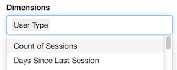

To use in Shiny with a multi-user login, use googleAuth's `with_shiny`.  See the [`googleAuthR` readme](http://code.markedmondson.me/googleAuthR/) for details on general Google authentication with Shiny. 

A video tutorial on how to create a [Shiny app with googleAnalyticsR](https://www.youtube.com/watch?v=4Ht_vEXJ4wo) is available below.  The first 20 mins creates a basic Shiny app fetching data, the last 20 mins go into combining with other libraries and using custom HTML templates:


<iframe width="560" height="315" src="http://www.youtube.com/embed/4Ht_vEXJ4wo?rel=0" frameborder="0" allowfullscreen></iframe>

```r
## in server.R
library(googleAuthR)
library(googleAnalyticsR)
library(shiny)

shinyServer(function(input, output, session){
  
  ## Get auth code from return URL
  access_token  <- callModule(googleAuth, "auth1")

  gadata <- reactive({

    with_shiny(google_analytics_3,
               id = "222222", ## replace with your View ID
               start="2015-08-01", end="2015-08-02", 
               metrics = c("sessions", "bounceRate"), 
               dimensions = c("source", "medium"),
               shiny_access_token = access_token())
  })
  
  output$something <- renderPlot({
  
    ## only trigger once authenticated
    req(access_token())
    
    gadata <- gadata()
    
    plot(gadata)
  
  })
  
})

## ui.R
library(googleAuthR)
library(shiny)

shinyUI(fluidPage(

  googleAuthUI("auth1"),
  plotOutput("something")

))

```

To aid with creating Shiny apps using this package, some [Shiny modules](http://shiny.rstudio.com/articles/modules.html) are available.

## Authentication modules

`authDropdown` and `authDropdownUI` create a row of selects to help with choosing a GA View.


Make sure to authenticate with at least `https://www.googleapis.com/auth/analytics.edit` scopes since this is needed for listing GA accounts. 

This is useful in combination with `googleAuthR`'s `googleAuth` module that helps with user login:

```r
## ui.R
googleAuthUI("login"),
authDropdownUI("auth_menu")
```

```r
## server.R 

(...)

token <- callModule(googleAuth, "login")

ga_accounts <- reactive({
  validate(
    need(token(), "Authenticate")
  )

  with_shiny(ga_account_list, shiny_access_token = token())
  
  })

selected_id <- callModule(authDropdown, "auth_menu", ga.table = ga_accounts)

(...)

```

## Google Analytics 4 Account Picker

GA4 has different data model and account structure, so it has its own account picker module at `accountPicker()` - this also uses the more modern Shiny module style.  GA4 only has accounts and web propertyId, not viewIds.

A minimal example on how to use it is shown below:

```r
library(shiny)
library(googleAnalyticsR) # for accountPicker
library(googleAuthR)      # for gar_shiny_ui

ui <- fluidPage(title = "Shiny App",
                accountPickerUI("auth_menu", inColumns = TRUE))
server <- function(input, output, session){
  token <- gar_shiny_auth(session)
  
  accs <- reactive({
    req(token)
    ga_account_list("ga4")
  })
  
  # module for authentication
  property_id <- accountPicker("auth_menu", ga_table = accs, id_only = TRUE)
}

shinyApp(gar_shiny_ui(ui, login_ui = silent_auth), server)

```

## Parameter selects

`multiSelect` and `multiSelectUI` create select dropdowns with the GA API parameters filled in, taken from the meta API.




## Segment helper

`segmentBuilder` and `segmentBuilderUI` creates a segment builder interface.  This is also available as an RStudio gadget to help create segments more easily.


## Example

An example of a Shiny app is shown below, that allows users to login in, select an account using the modules above, and then see their data via Highcharts

The code for the explorer is included below:

### ui.R

```r
## ui.R
library(googleAuthR)
library(googleAnalyticsR)
library(shiny)
library(highcharter)

shinyUI(
  fluidPage(
    googleAuthUI("login"),
    authDropdownUI("auth_menu"),
    highchartOutput("something")
    
  ))
```

### server.R

```r
## in server.R
library(googleAuthR)
library(googleAnalyticsR)
library(shiny)
library(highcharter)

function(input, output, session){
  
  ## Get auth code from return URL
  token <- callModule(googleAuth, "login")
  
  ga_accounts <- reactive({
    req(token())
    
    with_shiny(ga_account_list, shiny_access_token = token())
    
  })
  
  selected_id <- callModule(authDropdown, "auth_menu", ga.table = ga_accounts)
  
  gadata <- reactive({
    
    req(selected_id())
    gaid <- selected_id()
    with_shiny(google_analytics_3,
               id = gaid,
               start="2015-08-01", end="2017-08-02", 
               metrics = c("sessions"), 
               dimensions = c("date"),
               shiny_access_token = token())
  })
  
  output$something <- renderHighchart({
    
    ## only trigger once authenticated
    req(gadata())
    
    gadata <- gadata()
    
    ## creates a line chart using highcharts
    hchart(gadata, "line" , hcaes(x = date, y = sessions))
    
  })
  
}
```