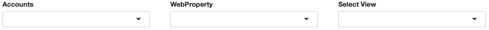
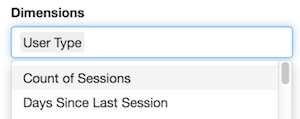

To use in Shiny with a multi-user login, use googleAuth's `with_shiny`.  See the [`googleAuthR` readme](http://code.markedmondson.me/googleAuthR/) for details on general Google authentication with Shiny. 

```r
## in server.R
library(googleAuthR)
library(googleAnalyticsR)
library(shiny)

shinyServer(function(input, output, session){
  
  ## Get auth code from return URL
  access_token  <- callModule(googleAuth, "auth1")

  gadata <- reactive({

    with_shiny(google_analytics,
               id = "222222", ## replace with your View ID
               start="2015-08-01", end="2015-08-02", 
               metrics = c("sessions", "bounceRate"), 
               dimensions = c("source", "medium"),
               shiny_access_token = access_token())
  })
  
  output$something <- renderPlot({
  
    ## only trigger once authenticated
    req(access_token())
    
    gadata <- gadata()
    
    plot(gadata)
  
  })
  
})

## ui.R
library(googleAuthR)
library(shiny)

shinyUI(fluidPage(

  googleAuthUI("auth1"),
  plotOutput("something")

))

```

## Shiny Modules

To aid with creating Shiny apps using this package, some [Shiny modules](http://shiny.rstudio.com/articles/modules.html) are available.

### Authentication modules

`authDropdown` and `authDropdownUI` create a row of selects to help with choosing a GA View.



This is useful in combination with `googleAuthR`'s `googleAuth` module that helps with user login:

```r
## ui.R
googleAuthUI("login"),
authDropdownUI("auth_menu")
```

```r
## server.R 

(...)

token <- callModule(googleAuth, "login")

ga_accounts <- reactive({
  validate(
    need(token(), "Authenticate")
  )

  with_shiny(google_analytics_account_list, shiny_access_token = token())
  
  })

selected_id <- callModule(authDropdown, "auth_menu", ga.table = ga_accounts)

(...)

```

### Parameter selects

`multiSelect` and `multiSelectUI` create select dropdowns with the GA API parameters filled in, taken from the meta API.




### Segment helper

`segmentBuilder` and `segmentBuilderUI` creates a segment builder interface.  This is also available as an RStudio gadget to help create segments more easily.


## V4 API Shiny app

An example of a Shiny app is the [V4 API explorer](https://mark.shinyapps.io/googleAnalyticsRv4Demo/), this code is available in the package and at [Github here](https://github.com/MarkEdmondson1234/googleAnalyticsR/tree/master/inst/shiny/ga4-example/ga4_demo)

The code for the explorer is included below:

### ui.R

```r
library(shiny)
library(googleAuthR)
library(googleAnalyticsR)
library(listviewer)
library(testthat)


navbarPage("GA v4 API",
           tabPanel("Setup", tabName = "setup", icon = icon("cogs"),
                    h1("A tour of GA reporting API v4"),
                    helpText("A demonstration of some of the new features available over the traditional v3 API."),
                    helpText("Start by logging in to your Google Analytics account."),
                    googleAuthUI("login"),
                    authDropdownUI("auth_menu")
           ),
           tabPanel("Segments", tabName = "segments", icon = icon("object-group"),
                    fluidRow(
                      column(width = 8, offset = 2,
                             h2("Segment setup"),
                             segmentBuilderUI("demo_segments")
                      )
                    ),
                    fluidRow(
                      column(width = 8, offset = 2,
                             h2("GA Data to Segment"),
                             multi_selectUI("metric_seg", "Metric", width = "100%"),
                             multi_selectUI("dim_seg", "Dimensions", width = "100%"),
                             dateRangeInput("date_seg", "Date Range", start = Sys.Date() - 30, width = "100%"),
                             helpText("Segments are more in line to what can be configured in the GA interface."),
                             helpText("They are a lot more powerful, but complex to configure."),
                             actionButton("get_seg", "Fetch Segment Data", icon = icon("download"), class = "btn-success"),
                             hr(),
                             h2("Results"),
                             dataTableOutput("segment_table"),
                             hr(),
                             h2("JSON API object"),
                             helpText("The JSON object for segments is shown below for reference."),
                             jsoneditOutput("segment_object")
                      ))),
           tabPanel("Calculated Metrics", tabName = "calc_metrics", icon = icon("calculator"),
                    h2("Calculated Metrics"),
                    fluidRow(
                      column(width = 6,
                             textInput("calculated_name", label = "Calculated Name", value = "Sessions Per Pageview")
                      ),
                      column(width = 6,
                             textInput("calculated_exp", label = "Calculated Expression", value = "ga:sessions / ga:pageviews")   
                      )
                    ),
                    fluidRow(
                      column(width = 6,
                             multi_selectUI("metric_calc", "Normal Metrics")     
                      ),
                      column(width = 6,
                             multi_selectUI("dim_calc", "Dimensions")  
                      )
                    ),
                    fluidRow(
                      column(width = 6,
                             dateRangeInput("date_clac", "Date Range") 
                      ),
                      column(width = 6,
                             br()
                      )
                    ),
                    helpText("Calculated metrics let you create your own metrics on the fly"),
                    actionButton("get_calc", "Fetch Calculated Metric data", icon = icon("download"), class = "btn-success"),
                    hr(),
                    h2("Results"),
                    dataTableOutput("calc_table"),
                    hr(),
                    h2("JSON API object"),
                    helpText("The JSON object for calculated metrics is shown below for reference."),
                    jsoneditOutput("calc_object")
           ),
           tabPanel("Pivots", tabName = "pivots", icon = icon("sort-amount-desc"),
                    h2("Pivots"),
                    fluidRow(
                      column(width = 6,
                             multi_selectUI("metric_pivot", "Metric")   
                      ),
                      column(width = 6,
                             multi_selectUI("dim_pivot", "Dimensions")   
                      )
                    ),
                    fluidRow(
                      column(width = 6,
                             dateRangeInput("date_pivot", "Date Range") 
                      ),
                      column(width = 6,
                             br() 
                      )
                    ),
                    fluidRow(
                      column(width = 6,
                             multi_selectUI("metric_pivot2", "Pivot Metric") 
                      ),
                      column(width = 6,
                             multi_selectUI("dim_pivot2", "Pivot Dimension")  
                      )
                      
                    ),
                    
                    helpText("Pivot fetches reshape the data you can fetch from the API. Useful for making 'long' data 'wide', it means you don't have to perform more data transformation yourself."),
                    helpText("Examples include breaking out traffic sources per column, or event labels per category."),
                    actionButton("get_pivot", "Fetch Pivot Data", icon = icon("download"), class = "btn-success"),
                    hr(),
                    h2("Results"),
                    dataTableOutput("pivot_table"),
                    hr(),
                    h2("JSON API object"),
                    helpText("The JSON object for pivots is shown below for reference."),
                    jsoneditOutput("pivot_object")
           ),
           tabPanel("Multiple Dates", tabName = "multi_dates", icon = icon("calendar"),
                    h2("Multiple Dates"),
                    fluidRow(
                      column(width = 6,
                             multi_selectUI("metric_md", "Metric")
                      ),
                      column(width = 6,
                             multi_selectUI("dim_md", "Dimensions")
                      )
                    ),
                    fluidRow(
                      column(width = 6,
                             dateRangeInput("date1_md", "Date Range 1", start = Sys.Date() - 30)   
                      ),
                      column(width = 6,
                             dateRangeInput("date2_md", "Date Range 2", start = Sys.Date() - 60, end = Sys.Date() - 31)
                      )
                      
                    ),
                    
                    helpText("Multiple date range fetches let you do direct comparisons without needing two API calls."),
                    actionButton("get_md", "Fetch Multidate Data", icon = icon("download"), class = "btn-success"),
                    hr(),
                    h2("Results"),
                    dataTableOutput("md_table"),
                    hr(),
                    h2("JSON API object"),
                    helpText("The JSON object for multi-date is shown below for reference."),
                    jsoneditOutput("md_object")
           ),
           tabPanel("Cohorts", tabName = "cohorts", icon = icon("users"),
                    h2("Cohorts"),
                    fluidRow(
                      column(width = 6,
                             multi_selectUI("metric_coh", "Metric")  
                      ),
                      column(width = 6,
                             multi_selectUI("dim_coh", "Dimensions")  
                      )
                    ),
                    fluidRow(
                      column(width = 6,
                             textInput("coh1", label = "Cohort 1 Name", value = "Cohort 1")     
                      ),
                      column(width = 6,
                             dateRangeInput("date_coh1", "Cohort 1 Range", start = Sys.Date() - 30, end = Sys.Date())
                      )
                    ),
                    fluidRow(
                      column(width = 6,
                             textInput("coh2", label = "Cohort 2 Name", value = "Cohort 2")
                      ),
                      column(width = 6,
                             dateRangeInput("date_coh2", "Cohort 2 Range", start = Sys.Date() - 60, end = Sys.Date() - 30)
                      )
                    ),
                    fluidRow(
                      column(width = 6,
                             textInput("coh3", label = "Cohort 3 Name", value = "Cohort 3")
                      ),
                      column(width = 6,
                             dateRangeInput("date_coh3", "Cohort 3 Range", start = Sys.Date() - 90, end = Sys.Date() - 60) 
                      )
                    ),
                    fluidRow(
                      column(width = 6,
                             textInput("coh4", label = "Cohort 4 Name", value = "Cohort 4")   
                      ),
                      column(width = 6,
                             dateRangeInput("date_coh4", "Cohort 4 Range", start = Sys.Date() - 120, end = Sys.Date() - 90)
                      )
                    ),
                    helpText("Cohorts are unique to the v4 API, letting you examine user behaviour as it changes over time."),
                    actionButton("get_cohort", "Fetch Cohorts Data", icon = icon("download"), class = "btn-success"),
                    hr(),
                    h2("Results"),
                    dataTableOutput("cohort_table"),
                    hr(),
                    h2("JSON API object"),
                    helpText("The JSON object for cohorts is shown below for reference."),
                    jsoneditOutput("cohort_object")
           ),
           helpText("Copyright 2016 Sunholo Ltd. Released under MIT license."),
           helpText("Created using R, Shiny and ", a(href = "http://code.markedmondson.me/googleAnalyticsR", "googleAnalyticsR")),
           helpText(a(href = "http://code.markedmondson.me", "Blog")," | ", a(href = "http://twitter.com/HoloMarkeD", "@HoloMarkeD"))
)

```

### server.R

```r
library(shiny)
library(googleAuthR)
library(googleAnalyticsR)
library(listviewer)

## this is set before you launch the app, 
## as the default local port is 1221
## change this to the port you use if on your own Google project keys
options(shiny.port = 1221)
options(googleAuthR.webapp.client_id = "289759286325-42j8nmkeq5n9v9eb1kiuj2i97v9oea1f.apps.googleusercontent.com")
options(googleAuthR.webapp.client_secret = "0zBtmZ_klTEzXUaTUTP5AkNQ")
options(googleAuthR.scopes.selected = c("https://www.googleapis.com/auth/analytics.readonly"))

shinyServer(function(input, output, session){
  
  #####--------- Setup
  
  token <- callModule(googleAuth, "login")
  
  ga_accounts <- reactive({
    validate(
      need(token(), "Authenticate")
    )
    
    with_shiny(google_analytics_account_list, shiny_access_token = token())
  })
  
  selected_id <- callModule(authDropdown, "auth_menu", ga.table = ga_accounts)
  
  #####--------- Segments
  
  segment_built <- callModule(segmentBuilder, "demo_segments")
  
  segment_metrics <- callModule(multi_select, "metric_seg", type = "METRIC", subType = "segment")
  segment_dims <- callModule(multi_select, "dim_seg", type = "DIMENSION", subType = "segment")
  
  segment_data <- eventReactive(input$get_seg, {
    
    viewId <- selected_id()
    metrics <- segment_metrics()
    dims <- c("ga:segment", segment_dims())
    dates <- input$date_seg
    segment_built <- segment_built()
    
    with_shiny(google_analytics_4,
               shiny_access_token = token(),
               viewId = viewId,
               date_range = c(dates[1], dates[2]),
               metrics = metrics,
               dimensions = dims,
               segments = segment_built)
    
  })
  
  output$segment_table <- renderDataTable({
    
    segment_data()
    
  })
  
  output$segment_object <- renderJsonedit({
    
    jsonedit(
      as.list( segment_built() )
      ,"change" = htmlwidgets::JS('function(){
                                  console.log( event.currentTarget.parentNode.editor.get() )
  }')
    )
    
    
    
})
  
  #####--------- Cohorts
  
  cohort_metrics <- callModule(multi_select, "metric_coh", 
                               type = "METRIC", 
                               subType = "cohort")
  
  cohort_dims <- callModule(multi_select, "dim_coh", 
                            type = "DIMENSION", 
                            subType = "cohort", 
                            default = "ga:cohort")
  
  cohort_built <- reactive({
    
    coh_d1 <- as.character(input$date_coh1)
    coh_d2 <- as.character(input$date_coh2)    
    coh_d3 <- as.character(input$date_coh3)
    coh_d4 <- as.character(input$date_coh4)
    coh1 <- input$coh1
    coh2 <- input$coh2
    coh3 <- input$coh3
    coh4 <- input$coh4
    
    c_list <- list(c(coh_d1[1], coh_d1[2]),
                   c(coh_d2[1], coh_d2[2]),
                   c(coh_d3[1], coh_d3[2]),
                   c(coh_d4[1], coh_d4[2]))
    names(c_list) <-  c(coh1, coh2, coh3, coh4)
    
    make_cohort_group(c_list)
    
  })
  
  cohort_data <- eventReactive(input$get_cohort, {
    
    viewId <- selected_id()
    metrics <- cohort_metrics()
    dims <- cohort_dims()
    cohort_built <- cohort_built()
    
    with_shiny(google_analytics_4,
               shiny_access_token = token(),
               viewId = viewId,
               metrics = metrics,
               dimensions = dims,
               cohort = cohort_built)
    
  })
  
  output$cohort_table <- renderDataTable({
    
    cohort_data()
    
  })
  
  output$cohort_object <- renderJsonedit({
    
    jsonedit(
      as.list( cohort_built() )
      ,"change" = htmlwidgets::JS('function(){
                                  console.log( event.currentTarget.parentNode.editor.get() )
  }')
    )
    
    
    
})
  
  #####--------- Multi-date
  
  md_metrics <- callModule(multi_select, "metric_md", type = "METRIC", subType = "all")
  md_dims <- callModule(multi_select, "dim_md", type = "DIMENSION", subType = "all")
  
  md_data <- eventReactive(input$get_md, {
    
    viewId <- selected_id()
    metrics <- md_metrics()
    dims <- md_dims()
    dates1 <- input$date1_md
    dates2 <- input$date2_md
    
    with_shiny(google_analytics_4,
               shiny_access_token = token(),
               viewId = viewId,
               date_range = c(dates1[1], dates1[2], dates2[1], dates2[2]),
               metrics = metrics,
               dimensions = dims)
    
  })
  
  output$md_table <- renderDataTable({
    
    md_data()
    
  })
  
  md_object <- reactive({
    
    viewId <- selected_id()
    metrics <- md_metrics()
    dims <- md_dims()
    dates1 <- input$date1_md
    dates2 <- input$date2_md
    
    out <- make_ga_4_req(google_analytics_4,
                         viewId = viewId,
                         date_range = c(dates1[1], dates1[2], dates2[1], dates2[2]),
                         metrics = metrics,
                         dimensions = dims)
    out$dimensionFilterClauses <- NULL
    out
    
  })
  
  output$md_object <- renderJsonedit({
    
    jsonedit(
      as.list( md_object() )
      ,"change" = htmlwidgets::JS('function(){
                                  console.log( event.currentTarget.parentNode.editor.get() )
  }')
    )
    
    
    
})
  
  #####--------- Pivots 
  
  pv_metrics <- callModule(multi_select, "metric_pivot", type = "METRIC", subType = "all") 
  
  pv_dims <- callModule(multi_select, "dim_pivot", 
                        type = "DIMENSION", 
                        subType = "all", 
                        default = "ga:source")
  
  pv_metrics2 <- callModule(multi_select, "metric_pivot2", type = "METRIC", subType = "all")
  
  pv_dims2 <- callModule(multi_select, "dim_pivot2", 
                         type = "DIMENSION", 
                         subType = "all",
                         default = "ga:medium")
  
  pivot_object <- reactive({
    
    
    pv_metrics2 <- pv_metrics2()
    pv_dims2 <- pv_dims2()
    
    pivot_ga4(pv_dims2, pv_metrics2)
    
  })
  
  pivot_data <- eventReactive(input$get_pivot,{
    
    viewId <- selected_id()
    metrics <- pv_metrics() 
    dims <- pv_dims()
    dates <- input$date_pivot
    pivot_object <- pivot_object()
    
    with_shiny(google_analytics_4,
               shiny_access_token = token(),
               viewId = viewId,
               date_range = c(dates[1], dates[2]),
               metrics = metrics,
               dimensions = dims,
               pivots = list(pivot_object))
    
    
  })
  
  output$pivot_table <- renderDataTable({
    
    pivot_data()
    
  })
  
  output$pivot_object <- renderJsonedit({
    
    jsonedit(
      as.list( pivot_object() )
      ,"change" = htmlwidgets::JS('function(){
                                  console.log( event.currentTarget.parentNode.editor.get() )
  }')
    )
    
    
    
})
  
  #####--------- Calculated Metrics
  
  calc_dim <- callModule(multi_select, "dim_calc", type = "DIMENSION", subType = "all")
  calc_met <- callModule(multi_select, "metric_calc", type = "METRIC", subType = "all")
  
  calc_data <- eventReactive(input$get_calc, {
    
    viewId <- selected_id()
    dims <- calc_dim()
    dates <- input$date_clac
    metric_name <- gsub(" ", "", input$calculated_name)
    metric_exp <- input$calculated_exp
    normal_metrics <- calc_met()
    
    exp_metrics <- setNames(metric_exp, metric_name)
    metrics <- c(exp_metrics, normal_metrics)
    
    with_shiny(google_analytics_4,
               shiny_access_token = token(),
               viewId = viewId,
               date_range = c(dates[1], dates[2]),
               metrics = metrics,
               dimensions = dims)
    
    
  })
  
  output$calc_table <- renderDataTable({
    
    calc_data()
    
  })
  
  calc_object <- reactive({
    
    viewId <- selected_id()
    dims <- calc_dim()
    dates <- input$date_clac
    metric_name <- gsub(" ", "", input$calculated_name)
    metric_exp <- input$calculated_exp
    normal_metrics <- calc_met()
    
    exp_metrics <- setNames(metric_exp, metric_name)
    metrics <- c(exp_metrics, normal_metrics)
    
    make_ga_4_req(viewId = viewId,
                  date_range = c(dates[1], dates[2]),
                  metrics = metrics,
                  dimensions = dims)
    
  })
  
  output$calc_object <- renderJsonedit({
    
    jsonedit(
      as.list( calc_object() )
      ,"change" = htmlwidgets::JS('function(){
                                  console.log( event.currentTarget.parentNode.editor.get() )
  }')
    )
    
    
    
  })
  
  
  })

```


