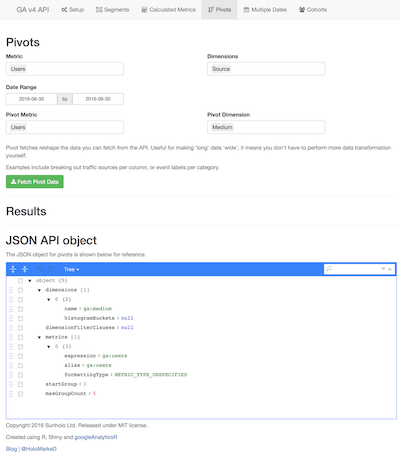
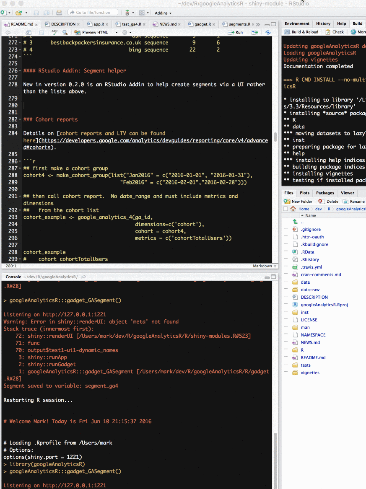

## v4 features

The v4 API is where new features will appear in the future.  

It currently has these extras implemented over the v3 API:

* Cohorts
* Multiple date ranges
* Pivot tables
* Calculated metrics on the fly
* Much more powerful segments

## v4 API Explorer Shiny app

A demo Shiny app where you can [explore the new v4 features](https://mark.shinyapps.io/googleAnalyticsRv4Demo/) is available.



## To use - v4 API calls

Consult `?google_analytics_4` and these example queries:

```r
## setup
library(googleAnalyticsR)

## authenticate, or use the RStudio Addin "Google API Auth" with analytics scopes set
ga_auth()

## get your accounts
account_list <- google_analytics_account_list()

## pick a profile with data to query
ga_id <- account_list[23,'viewId']

```

### Anti-sampling v4

A new feature from version `0.3.0` is anti-sampling via batching.

Sampling is due to your API request being over the session limits [outlined in this Google article](https://support.google.com/analytics/answer/2637192).  This limit is higher for Google Analytics 360.  

If you split up your API request so that the number of sessions falls under these limits, sampling will not occur.

#### Sampled data example

If you have sampling in your data request, `googleAnalyticsR` reports it back to you in the console when making the request. 

```r
> library(googleAnalyticsR)
> ga_auth()
> sampled_data_fetch <- google_analytics_4(id, 
                                           date_range = c(“2015-01-01”,”2015-06-21"), 
                                           metrics = c("users","sessions","bounceRate"), 
                                           dimensions = c("date","landingPagePath","source"))
Calling APIv4....
Data is sampled, based on 39.75% of visits.
```

#### Unsampled data example

Setting the new argument `anti_sample=TRUE` in a `google_analytics_4()` request now causes the calls to be split up into small enough chunks to avoid sampling.  This uses more API calls so the data will reach you slower, but it should hold more detail.

```r
> library(googleAnalyticsR)
> ga_auth()
> unsampled_data_fetch <- google_analytics_4(id, 
                                             date_range = c(“2015-01-01”,”2015-06-21"), 
                                             metrics = c("users","sessions","bounceRate"), 
                                             dimensions = c("date","landingPagePath","source"),
                                             anti_sample = TRUE)

anti_sample set to TRUE. Mitigating sampling via multiple API calls.
Finding how much sampling in data request...
Data is sampled, based on 39.75% of visits.
Downloaded [10] rows from a total of [59235].
Finding number of sessions for anti-sample calculations...
Downloaded [172] rows from a total of [172].
Calculated [3] batches are needed to download [59235] rows unsampled.
Anti-sample call covering 128 days: 2015-01-01, 2015-05-08
Looping over [2] batches.
Fetching data...
Fetching data...
Downloaded [59235] rows from a total of [59235].
Anti-sample call covering 23 days: 2015-05-09, 2015-05-31
Looping over [2] batches.
Fetching data...
Fetching data...
Downloaded [20239] rows from a total of [20239].
Anti-sample call covering 21 days: 2015-06-01, 2015-06-21
Looping over [2] batches.
Fetching data...
Fetching data...
Downloaded [21340] rows from a total of [21340].
Finished unsampled data request, total rows [100814]
Successfully avoided sampling
```

The sequence involves a couple of exploratory API calls to determine the best split.  This method will adjust the time periods to have the batch sizes large enough to not take too long, but small enough to have unsampled data.

#### Auto-anti sampling failure

In some cases the anti-sampling won't work.  This will mainly be due to filters for the View you are using meaning that the calculation for the sampling sessions are incorrect - Google Analytics vanilla samples on a property level (whilst GA360 samples on a View level).  

Try using a raw profile if you can, otherwise you can set your own sample period by using the `anti_sample_batches` flag to indicate the sample size.  Pick a number that is a little lower than the smallest period you saw in the auto-sample batches.  If in doubt, setting `anti_sample_batches` to 1 will make a daily fetch.

#### Hourly anti-sampling calls

For large traffic websites, sometimes even if the batches are down to one API call per day, it isn't enough to remove sampling.  In those cases, `googleAnalyticsR` will split the calls further into hourly batches.

If you are still experiencing sampling with hourly batches, then its time to use the [google_analytics_bq](big-query.html) function :)

### New Filter Syntax

```r
## create filters on metrics
mf <- met_filter("bounces", "GREATER_THAN", 0)
mf2 <- met_filter("sessions", "GREATER", 2)

## create filters on dimensions
df <- dim_filter("source","BEGINS_WITH","1",not = TRUE)
df2 <- dim_filter("source","BEGINS_WITH","a",not = TRUE)

## construct filter objects
fc2 <- filter_clause_ga4(list(df, df2), operator = "AND")
fc <- filter_clause_ga4(list(mf, mf2), operator = "AND")

## make v4 request
## demo showing how the new filters work
ga_data1 <- google_analytics_4(ga_id, 
                              date_range = c("2015-07-30","2015-10-01"),
                              dimensions=c('source','medium'), 
                              metrics = c('sessions','bounces'), 
                              met_filters = fc, 
                              dim_filters = fc2, 
                              filtersExpression = "ga:source!=(direct)")

ga_data1

#                     source   medium sessions bounces
# 1                  baby.dk referral        3       2
# 2                     bing  organic       71      42
# 3  buttons-for-website.com referral        7       7
# 4           duckduckgo.com referral        5       3
# 5                   google  organic      642     520
# 6                google.se referral        3       2
# 7                 izito.se referral        3       1
# 8          success-seo.com referral       35      35
# 9    video--production.com referral       11      11
# 10                   yahoo  organic       66      43
# 11              zapmeta.se referral        6       4
``` 


### Querying multiple report types at a time

Example with two date ranges and two reports.  When querying two date ranges, you can sort the metrics by how much they have changed by using `orderType = DELTA` e.g. `order_type("sessions", "DESCENDING", "DELTA")`


```r
## demo of querying two date ranges at a time   
## we make the request via make_ga_4_req() to use in next demo
multidate_test <- make_ga_4_req(ga_id, 
                                date_range = c("2015-07-30",
                                               "2015-10-01",
                                               "2014-07-30",
                                               "2014-10-01"),
                                dimensions = c('source','medium'), 
                                metrics = c('sessions','bounces'),
                                order = order_type("sessions", "DESCENDING", "DELTA"))
                                
ga_data2 <- fetch_google_analytics_4(multidate_test)
ga_data2
#                                     source      medium sessions.d1 bounces.d1 sessions.d2 bounces.d2
# 1                                 (direct)      (none)        5923       3328           0          0
# 2                        example_mem.co.uk    referral        5846       1100           0          0
# 3                                   google         cpc        5476       2669           0          0
# 4                           examp-link.net    referral        2241        653           0          0
# 5                    moneysavingexampl.com    referral        1869        549           0          0
# 6                            emailCampaign       email        1268        772           0          0


## Demo querying two reports at the same time
## Use make_ga_4_req() to make multiple requests and then send 
##   them as a list to fetch_google_analytics_4()
multi_test2 <- make_ga_4_req(ga_id,
                                date_range = c("2015-07-30",
                                               "2015-10-01",
                                               "2014-07-30",
                                               "2014-10-01"),
                             dimensions=c('hour','medium'), 
                             metrics = c('visitors','bounces'))

## all requests must have same viewID and dateRange
ga_data3 <- fetch_google_analytics_4(list(multidate_test, multi_test2)) 
ga_data3
# [[1]]
#                     source   medium sessions.d1 bounces.d1 sessions.d2 bounces.d2
# 1                  baby.dk referral           3          2           6          3
# 2                     bing  organic          71         42         217        126
# 3  buttons-for-website.com referral           7          7           0          0
# 4           duckduckgo.com referral           5          3           0          0
# 5                   google  organic         642        520        1286        920
# 6                google.se referral           3          2          12          9
# 7                 izito.se referral           3          1           0          0
# 8          success-seo.com referral          35         35           0          0
# 9    video--production.com referral          11         11           0          0
# 10                   yahoo  organic          66         43         236        178
# 11              zapmeta.se referral           6          4           9          4
# 
# [[2]]
#    hour   medium visitors.d1 bounces.d1 visitors.d2 bounces.d2
# 1    00  organic          28         16          85         59
# 2    00 referral           3          2           1          1
# 3    01  organic          43         28          93         66


```

### On-the-fly calculated metrics


```r
ga_data4 <- google_analytics_4(ga_id,
                               date_range = c("2015-07-30",
                                              "2015-10-01"),
                              dimensions=c('medium'), 
                              metrics = c(visitsPerVisitor = "ga:visits/ga:visitors",
                                          'bounces'), 
                              metricFormat = c("FLOAT","INTEGER"))
ga_data4
#     medium visitsPerVisitor bounces
# 1   (none)         1.000000     117
# 2  organic         1.075137     612
# 3 referral         1.012500      71
```

### Segments v4

Segments are more complex to configure that v3, but more powerful and in line to how you configure them in the UI.

A lot of feedback for the library is on how to get the segment syntax right, so the examples below try to cover common scenarios.

#### v3 segments

You can choose to create segments via the v4 syntax or the v3 syntax for backward compatibility.

If you want to use v3 segments, then they can be used in the `segment_id` argument of the `segment_ga4()` function.

You can view the segment Ids by using `ga_segment_list()` and the data.frame in `$items`

```r
## get list of segments
my_segments <- ga_segment_list()

## just the segment items
segs <- my_segments$items

## segment Ids and name:
segs[,c("name","id","defintion")]

## example output
  id            name                                                          definition
1 -1       All Users                                                                    
2 -2       New Users                       sessions::condition::ga:userType==New Visitor
3 -3 Returning Users                 sessions::condition::ga:userType==Returning Visitor
4 -4    Paid Traffic         sessions::condition::ga:medium=~^(cpc|ppc|cpa|cpm|cpv|cpp)$
5 -5 Organic Traffic                             sessions::condition::ga:medium==organic
6 -6  Search Traffic sessions::condition::ga:medium=~^(cpc|ppc|cpa|cpm|cpv|cpp|organic)$
....

```

The ID you require is in the `$id` column which you need to prefix with "gaid::"

```r
## choose the v3 segment
segment_for_call <- "gaid::-4"

## make the v3 segment object in the v4 segment object:
seg_obj <- segment_ga4("PaidTraffic", segment_id = segment_for_call)

## make the segment call
segmented_ga1 <- google_analytics_4(ga_id, 
                                    c("2015-07-30","2015-10-01"), 
                                    dimensions=c('source','medium','segment'), 
                                    segments = seg_obj, 
                                    metrics = c('sessions','bounces')
                                    )
  
``` 

...or you can pass the v3 syntax for dynamic segments found from the `$definition` column:

```r
## or pass the segment v3 defintion in directly:
segment_def_for_call <- "sessions::condition::ga:medium=~^(cpc|ppc|cpa|cpm|cpv|cpp)$"

## make the v3 segment object in the v4 segment object:
seg_obj <- segment_ga4("PaidTraffic", segment_id = segment_def_for_call)

## make the segment call
segmented_ga1 <- google_analytics_4(ga_id, 
                                    c("2015-07-30","2015-10-01"), 
                                    dimensions=c('source','medium','segment'), 
                                    segments = seg_obj, 
                                    metrics = c('sessions','bounces')
                                    )
```


#### v4 segment syntax

However, its recommended you embrace the new v4 syntax, as its more flexible and powerful in the long run.

The hierarachy of the segment elements you will need are:

* *`segment_ga4()`* - this is the top of the segment tree.  You can pass one or a list of these into a `google_analytics_4()` segment argument.  Here you name the segment as it will appear in the `segment` dimension, and pass in segment definitions either via an existing segmentID or v3 definition; via a user scoped level; or via a session scoped level.  The user and session scopes can have one or a list of `segment_define()` functions.
* *`segment_define()`* - this is where you define the types of segment filters that you are passing in - they are combined in a logical AND.  The segment filters can be of a `segment_vector_simple` type (where order doesn't matter) or a `segment_vector_sequence` type (where order does matter.)  You can also pass in a `not_vector` of the same length as the list of segment filters, which dictates if the segments you pass in are included (the default) or excluded.
* *`segment_vector_simple()`* and *`segment_vector_sequence()`* - these are vectors of `segment_element`, and determine if the conditions are included in a logical OR fashion, or if the sequence of steps is important (for instance users who saw this page, then that page.)  
* *`segment_element`* - this is the lowest atom of segments, and lets you define on which metric or dimension you are segmenting on. You pass one or a list of these to *`segment_vector_simple()`* or *`segment_vector_sequence()`*


```r
## make two segment elements
se <- segment_element("sessions", 
                      operator = "GREATER_THAN", 
                      type = "METRIC", 
                      comparisonValue = 1, 
                      scope = "USER")
                      
se2 <- segment_element("medium", 
                      operator = "EXACT", 
                      type = "DIMENSION", 
                      expressions = "organic")

## choose between segment_vector_simple or segment_vector_sequence
## Elements can be combined into clauses, which can then be combined into OR filter clauses
sv_simple <- segment_vector_simple(list(list(se)))

sv_simple2 <- segment_vector_simple(list(list(se2)))

## Each segment vector can then be combined into a logical AND
seg_defined <- segment_define(list(sv_simple, sv_simple2))

## Each segement defintion can apply to users, sessions or both.
## You can pass a list of several segments
segment4 <- segment_ga4("simple", user_segment = seg_defined)

## Add the segments to the segments param
segment_example <- google_analytics_4(ga_id, 
                                      c("2015-07-30","2015-10-01"), 
                                      dimensions=c('source','medium','segment'), 
                                      segments = segment4, 
                                      metrics = c('sessions','bounces')
                                      )

segment_example
#                            source   medium segment sessions bounces
# 1                        24.co.uk referral  simple        1       1
# 2                     aidsmap.com referral  simple        1       0
# 3                             aol  organic  simple       30      19
# 4                             ask  organic  simple       32      17


## Sequence segment
  
  se2 <- segment_element("medium", 
                         operator = "EXACT", 
                         type = "DIMENSION", 
                         expressions = "organic")
  
  se3 <- segment_element("medium",
                         operator = "EXACT",
                         type = "DIMENSION",
                         not = TRUE,
                         expressions = "organic")
  
  ## step sequence
  ## users who arrived via organic then via referral
  sv_sequence <- segment_vector_sequence(list(list(se2), 
                                              list(se3)))
  
  seq_defined2 <- segment_define(list(sv_sequence))
  
  segment4_seq <- segment_ga4("sequence", user_segment = seq_defined2)
  
  ## Add the segments to the segments param
  segment_seq_example <- google_analytics_4(ga_id, 
                                            c("2016-01-01","2016-03-01"), 
                                            dimensions=c('source','segment'), 
                                            segments = segment4_seq,
                                            metrics = c('sessions','bounces')
  )
  
segment_seq_example
#                                source  segment sessions bounces
# 1                                 aol sequence        1       0
# 2                                 ask sequence        5       1
# 3      bestbackpackersinsurance.co.uk sequence        9       6
# 4                                bing sequence       22       2
```

Some more examples, using some of the match types, contributed by Pawel Kapuscinski:

```r
con1 <-segment_vector_simple(list(list(segment_element("ga:dimension1", 
                      operator = "REGEXP", 
                      type = "DIMENSION", 
                      expressions = ".*", 
                      scope = "SESSION"))))

con2 <-segment_vector_simple(list(list(segment_element("ga:deviceCategory", 
                      operator = "EXACT", 
                      type = "DIMENSION", 
                      expressions = "Desktop", 
                      scope = "SESSION"))))

seq1 <- segment_element("ga:pagePath", 
                         operator = "EXACT", 
                         type = "DIMENSION", 
                         expressions = "yourdomain.com/page-path", 
                         scope = "SESSION")


seq2 <- segment_element("ga:eventAction", 
                         operator = "REGEXP", 
                         type = "DIMENSION", 
                         expressions = "english", 
                         scope = "SESSION",
                         matchType = "IMMEDIATELY_PRECEDES")

allSEQ <- segment_vector_sequence(list(list(seq1), list(seq2)))

results <- google_analytics_4(ga_id, 
                             date_range = c("2016-08-08","2016-09-08"),
                             segments = segment_ga4("sequence+condition",
                                                    user_segment = segment_define(list(con1,con2,allSEQ))
                                                    ),
                             metrics = c('ga:users'),
                             dimensions = c('ga:segment'))


```

#### RStudio Addin: Segment helper

New in version 0.2.0 is an RStudio Addin to help create segments via a UI rather than the lists above.

You can call it via `googleAnalyticsR:::gadget_GASegment()` or within the RStudio interface like displayed below:



### Cohort reports

Details on [cohort reports and LTV can be found here](https://developers.google.com/analytics/devguides/reporting/core/v4/advanced#cohorts).

```r
## first make a cohort group
cohort4 <- make_cohort_group(list("Jan2016" = c("2016-01-01", "2016-01-31"), 
                                "Feb2016" = c("2016-02-01","2016-02-28")))

## then call cohort report.  No date_range and must include metrics and dimensions
##   from the cohort list
cohort_example <- google_analytics_4(ga_id, 
                                     dimensions=c('cohort'), 
                                     cohort = cohort4, 
                                     metrics = c('cohortTotalUsers'))

cohort_example
#    cohort cohortTotalUsers
# 1 Feb2016            19040
# 2 Jan2016            23378

```

### Pivot Requests


```r

## filter pivot results to 
pivot_dim_filter1 <- dim_filter("medium",
                                "REGEXP",
                                "organic|social|email|cpc")
                                
pivot_dim_clause <- filter_clause_ga4(list(pivot_dim_filter1))

pivme <- pivot_ga4("medium",
                   metrics = c("sessions"), 
                   maxGroupCount = 4, 
                   dim_filter_clause = pivot_dim_clause)

pivtest1 <- google_analytics_4(ga_id, 
                               c("2016-01-30","2016-10-01"), 
                               dimensions=c('source'), 
                               metrics = c('sessions'), 
                               pivots = list(pivme))


names(pivtest1)
#  [1] "source"                      "sessions"                    "medium.referral.sessions"   
#  [4] "medium..none..sessions"      "medium.cpc.sessions"         "medium.email.sessions"      
#  [7] "medium.social.sessions"      "medium.twitter.sessions"     "medium.socialMedia.sessions"
# [10] "medium.Social.sessions"      "medium.linkedin.sessions"  

```
